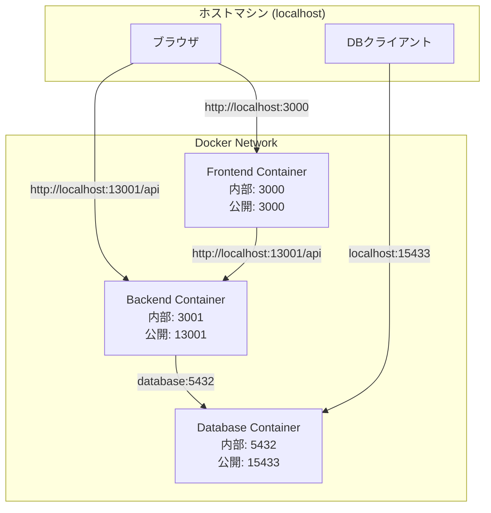
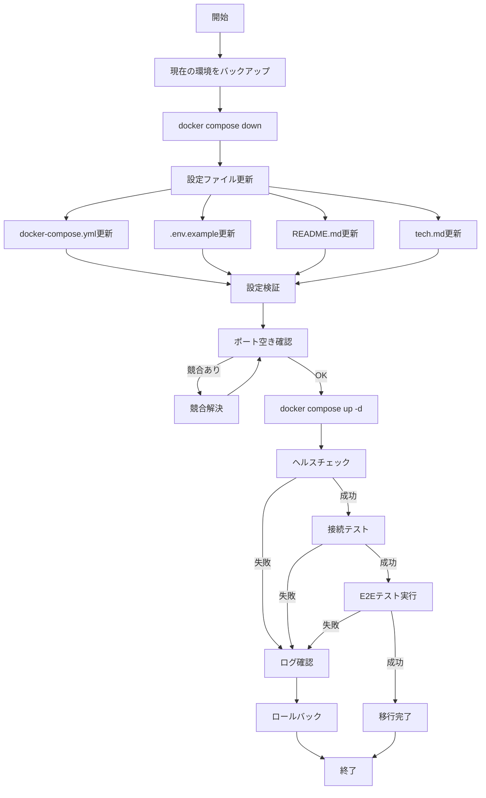

# 技術設計ドキュメント: ポート構成変更

## Overview

この機能は、社内イントラネットシステムのポート構成を変更し、企業ネットワークポリシーおよび他システムとのポート競合を回避します。データベースポートを5432から15433に、バックエンドAPIポートを3001から13001に変更することで、運用環境における柔軟性を向上させ、複数のサービスとの共存を可能にします。

**目的**: ポート競合を回避し、企業ネットワークポリシーに準拠したポート構成を実現する
**ユーザー**: システム管理者、バックエンド開発者、フロントエンド開発者、QAエンジニアがこの変更の影響を受ける
**影響**: 既存のDocker Compose構成、環境変数テンプレート、ドキュメント、E2Eテスト設定を変更する

### Goals
- データベースポートを15433に、バックエンドポートを13001に変更する
- すべての設定ファイル、ドキュメント、ステアリング文書を新しいポート構成に更新する
- E2Eテストとの互換性を維持する
- 開発者が最小限の労力で移行できるようにする

### Non-Goals
- フロントエンドポート（3000）の変更は含まない
- コンテナ内部ポート（PostgreSQL: 5432、Express: 3001）の変更は含まない
- プロダクション環境のポート構成変更は本設計の範囲外
- 既存のコード（backend/frontend アプリケーションロジック）の変更は不要

## Architecture

### 既存アーキテクチャ分析

現在のシステムは3層アーキテクチャ（フロントエンド、バックエンド、データベース）を採用し、Docker Composeで統合管理されています。

**現在のポート構成**:
```
ホストマシン          Docker内部ネットワーク
--------------       -------------------
3000:3000     →      Frontend (React)
3001:3001     →      Backend (Express) :3001
5432:5432     →      Database (PostgreSQL) :5432
```

**変更後のポート構成**:
```
ホストマシン          Docker内部ネットワーク
--------------       -------------------
3000:3000     →      Frontend (React)
13001:3001    →      Backend (Express) :3001
15433:5432    →      Database (PostgreSQL) :5432
```

**重要な考慮事項**:
- Docker内部ネットワークのポート（コンテナ内部）は変更しない
- ホストマシンからのアクセスポートのみを変更する
- フロントエンドからバックエンドへのAPI呼び出しはホストマシン経由（localhost:13001）
- バックエンドからデータベースへの接続はDocker内部ネットワーク経由（database:5432）

### 高レベルアーキテクチャ



### 技術アライメント

**既存パターンの維持**:
- Docker Composeベースのマルチコンテナ管理
- 環境変数による構成管理（.env、docker-compose.yml）
- 3層アーキテクチャの分離（Frontend/Backend/Database）

**新しい変更の根拠**:
- ポートマッピングの更新のみで、アーキテクチャパターンは変更なし
- Docker内部ネットワークは変更せず、ホスト公開ポートのみ変更

**技術スタックとの整合性**:
- Docker Compose: ポートマッピング機能を使用（既存機能）
- React + Axios: 環境変数REACT_APP_API_URLで接続先を制御（既存機能）
- Express: PORTは3001のまま維持（内部ポート）
- PostgreSQL: 内部ポート5432は維持、公開ポートのみ変更

**ステアリング準拠**:
- `.kiro/steering/structure.md`: 既存のファイル構造を維持
- `.kiro/steering/tech.md`: ポート構成セクションを更新
- `.kiro/steering/product.md`: 製品機能に影響なし

## 要件トレーサビリティ

| 要件 | 要件概要 | 影響を受けるコンポーネント | 変更内容 |
|------|----------|---------------------------|----------|
| 1.1 | Databaseポートマッピング変更 | docker-compose.yml | ports: "15433:5432" |
| 1.2 | Backendポートマッピング変更 | docker-compose.yml | ports: "13001:3001" |
| 1.3 | Frontendポート維持 | docker-compose.yml | ports: "3000:3000" (変更なし) |
| 2.1 | .env.exampleへのDB_PORT追加 | .env.example | コメントで15433を説明 |
| 2.2-2.5 | README.md更新 | README.md | ポート構成、アクセスURL、データベースセクション |
| 3.1-3.3 | Backend環境変数 | docker-compose.yml | PORT=3001維持、ポートマッピング変更 |
| 4.1-4.2 | Frontend API URL更新 | docker-compose.yml, frontend/.env.example | REACT_APP_API_URL更新 |
| 5.1-5.3 | データベース接続設定 | docker-compose.yml | ポートマッピング変更、内部接続は維持 |
| 6.1-6.4 | ステアリングドキュメント更新 | .kiro/steering/tech.md | ポート番号とアーキテクチャ図更新 |
| 7.1-7.3 | E2Eテスト互換性 | e2e-tests/playwright.config.ts | baseURL: 3000維持（変更不要） |
| 8.1-8.3 | 後方互換性と移行 | docker-compose.yml | Docker Composeの挙動で自動対応 |

## コンポーネントと詳細設計

### インフラストラクチャ層

#### Docker Compose 設定ファイル

**責任と境界**
- **主要責任**: コンテナのポートマッピング、環境変数定義、サービス間依存関係の管理
- **ドメイン境界**: インフラストラクチャ設定層
- **データ所有権**: ポート設定、環境変数、ボリュームマウント設定

**依存関係**
- **インバウンド**: Docker Composeコマンド（docker compose up/down）
- **アウトバウンド**: Dockerエンジン、コンテナイメージ
- **外部**: .envファイル（環境変数のソース）

**変更内容**

```yaml
# database サービス
ports:
  - "15433:5432"  # ホスト:コンテナ

# backend サービス
ports:
  - "13001:3001"  # ホスト:コンテナ
environment:
  - PORT=3001     # コンテナ内部ポート（変更なし）

# frontend サービス
environment:
  - REACT_APP_API_URL=http://localhost:13001/api
```

**設計上の注意点**:
- **コンテナ内部ポート**: PostgreSQL (5432)、Express (3001) は変更しない
- **ホスト公開ポート**: PostgreSQL (15433)、Express (13001) に変更
- **フロントエンドの環境変数**: REACT_APP_API_URLをlocalhost:13001に変更
- **バックエンドのDB接続**: DB_HOST=database、DB_PORT=5432 (Docker内部接続のため変更不要)

### ドキュメント層

#### 環境変数テンプレート (.env.example)

**責任と境界**
- **主要責任**: 開発者向けの環境変数設定テンプレート提供
- **ドメイン境界**: 開発環境セットアップドキュメント

**変更内容**

```bash
DB_NAME=intranet_db
DB_USER=postgres
DB_PASSWORD=postgres
JWT_SECRET=your-jwt-secret-key-change-in-production
NODE_ENV=development

# ポート設定（Docker Composeで定義、参考情報として記載）
# Database: ホストマシンからlocalhost:15433でアクセス可能
# Backend API: ホストマシンからlocalhost:13001でアクセス可能
# Frontend: ホストマシンからlocalhost:3000でアクセス可能
```

#### プロジェクトREADME (README.md)

**責任と境界**
- **主要責任**: プロジェクト概要、セットアップ手順、ポート構成の文書化
- **ドメイン境界**: プロジェクトドキュメント

**変更セクション**:

1. **アクセスURL セクション**:
```markdown
- Frontend: http://localhost:3000
- Backend API: http://localhost:13001
- Database: localhost:15433
```

2. **ポート構成 セクション**:
```markdown
| サービス | ポート | 用途 |
|---------|--------|------|
| Frontend | 3000 | React開発サーバー |
| Backend | 13001 | Express APIサーバー |
| Database | 15433 | PostgreSQL |
```

#### ステアリングドキュメント (.kiro/steering/tech.md)

**責任と境界**
- **主要責任**: AI支援開発時の技術的コンテキスト提供
- **ドメイン境界**: プロジェクト技術ガイドライン

**変更箇所**:
1. アーキテクチャ図内のポート番号
2. ポート構成テーブル
3. 環境構築手順のアクセスURL
4. 環境変数セクションのデフォルト値説明

### テスト層

#### E2Eテスト設定 (playwright.config.ts)

**責任と境界**
- **主要責任**: Playwrightテストの実行環境設定
- **ドメイン境界**: E2Eテスト自動化

**現在の設定分析**:
```typescript
use: {
  baseURL: 'http://localhost:3000',  // フロントエンド（変更不要）
}

webServer: {
  command: 'cd .. && npm run dev',
  url: 'http://localhost:3000',       // フロントエンド（変更不要）
}
```

**変更の必要性**:
- **変更不要**: PlaywrightのbaseURLはフロントエンド (localhost:3000) を指しており、これは変更されないため、設定変更は不要
- **API通信**: フロントエンドがバックエンド (localhost:13001) と通信する部分は、フロントエンドのREACT_APP_API_URL環境変数で制御されるため、Playwright設定の変更は不要

## データモデル

このポート構成変更は設定ファイルの変更のみであり、データモデルの変更は含まれません。

## エラー処理

### エラー戦略

ポート競合や設定ミスによるエラーを早期に検出し、明確なメッセージで開発者に通知します。

### エラーカテゴリと対応

**システムエラー (インフラ層)**:
- **ポート競合**:
  - **検出方法**: Docker Composeがポートバインドに失敗
  - **エラーメッセージ**: `Error starting userland proxy: listen tcp4 0.0.0.0:15433: bind: address already in use`
  - **対処方法**: 既存プロセスの確認と停止、または.envでポート番号を変更

- **Docker未起動**:
  - **検出方法**: docker compose upコマンドがDocker daemonに接続できない
  - **エラーメッセージ**: `Cannot connect to the Docker daemon`
  - **対処方法**: Dockerサービスの起動

**設定エラー (開発者ミス)**:
- **環境変数未設定**:
  - **検出方法**: .envファイルが存在しない場合のデフォルト値使用
  - **対応**: docker-compose.ymlにデフォルト値を設定済み (`${DB_NAME:-intranet_db}`)

- **不正なポート番号**:
  - **検出方法**: Docker Composeがyaml構文エラーを報告
  - **対処方法**: docker-compose.ymlの構文確認

### モニタリング

**起動確認**:
```bash
docker compose ps
# 全サービスがUpステータスであることを確認

docker compose logs database
# データベースの起動ログを確認

docker compose logs backend
# バックエンドの起動ログを確認
```

**接続確認**:
```bash
# データベース接続テスト
psql -h localhost -p 15433 -U postgres -d intranet_db

# バックエンドAPI接続テスト
curl http://localhost:13001/api/health

# フロントエンド接続テスト
curl http://localhost:3000
```

## テスト戦略

### 手動テスト

**設定ファイル検証**:
1. docker-compose.ymlのポートマッピング確認
2. .env.exampleのコメント確認
3. README.mdとtech.mdのポート番号確認

**起動テスト**:
1. `docker compose down` で既存環境をクリーンアップ
2. `docker compose up -d` で新しい設定を適用
3. `docker compose ps` で全サービスがUpステータスを確認
4. 各サービスのログを確認してエラーがないことを検証

**接続テスト**:
1. ブラウザでhttp://localhost:3000にアクセス（フロントエンド）
2. ブラウザでhttp://localhost:13001/apiにアクセス（バックエンドAPI）
3. DBクライアントでlocalhost:15433に接続（データベース）

### E2Eテスト

**既存E2Eテストの実行**:
1. `npm run test:e2e` を実行
2. すべてのテストがパスすることを確認
3. フロントエンド→バックエンド→データベースの通信フローが正常に動作することを検証

**テスト対象**:
- ログインフロー（認証API呼び出し）
- ホームページの表示（お知らせ取得API）
- 勤怠入力・報告機能（勤怠API）
- ナビゲーション（ページ遷移）

### 統合テスト

**Docker Compose統合テスト**:
```bash
# 1. クリーンアップ
docker compose down -v

# 2. 新しい設定で起動
docker compose up -d

# 3. ヘルスチェック待機
sleep 30

# 4. サービス状態確認
docker compose ps | grep Up

# 5. 接続テスト
curl -f http://localhost:3000 || exit 1
curl -f http://localhost:13001/api/health || exit 1
psql -h localhost -p 15433 -U postgres -d intranet_db -c "SELECT 1" || exit 1
```

## 移行戦略



### フェーズ分解

**Phase 1: 準備（5分）**
1. 現在の環境状態をバックアップ（docker-compose.yml、.env）
2. ポート15433と13001が空いていることを確認
   ```bash
   lsof -i :15433
   lsof -i :13001
   ```

**Phase 2: 設定変更（10分）**
1. docker-compose.ymlのポートマッピング変更
2. .env.exampleのコメント追加
3. README.mdのポート情報更新
4. .kiro/steering/tech.mdの更新

**Phase 3: 適用とテスト（15分）**
1. `docker compose down` で既存環境停止
2. `docker compose up -d` で新環境起動
3. `docker compose ps` でサービス状態確認
4. 各サービスへの接続テスト
5. `npm run test:e2e` でE2Eテスト実行

### ロールバック トリガー

以下の場合、即座にロールバックします:
- Docker Composeの起動に失敗
- いずれかのサービスがヘルスチェックに失敗
- E2Eテストが失敗
- フロントエンド、バックエンド、データベースのいずれかに接続できない

**ロールバック手順**:
```bash
# 1. 新環境を停止
docker compose down

# 2. バックアップから設定ファイルを復元
cp docker-compose.yml.backup docker-compose.yml

# 3. 旧環境を起動
docker compose up -d

# 4. 正常性確認
docker compose ps
curl http://localhost:3000
curl http://localhost:3001/api/health
```

### 検証チェックポイント

**各フェーズ完了時**:
- [ ] Phase 1: バックアップファイルが作成されている
- [ ] Phase 2: すべての設定ファイルが更新されている
- [ ] Phase 3: すべてのサービスがUpステータス
- [ ] Phase 3: 全E2Eテストがパス
- [ ] Phase 3: ドキュメントが正しく更新されている

**最終確認**:
- [ ] ブラウザでフロントエンド (localhost:3000) にアクセス可能
- [ ] バックエンドAPI (localhost:13001/api) にアクセス可能
- [ ] DBクライアントでデータベース (localhost:15433) に接続可能
- [ ] フロントエンドからバックエンドへのAPI呼び出しが正常に動作
- [ ] バックエンドからデータベースへのクエリが正常に動作
- [ ] README.mdとtech.mdが新しいポート番号に更新されている
